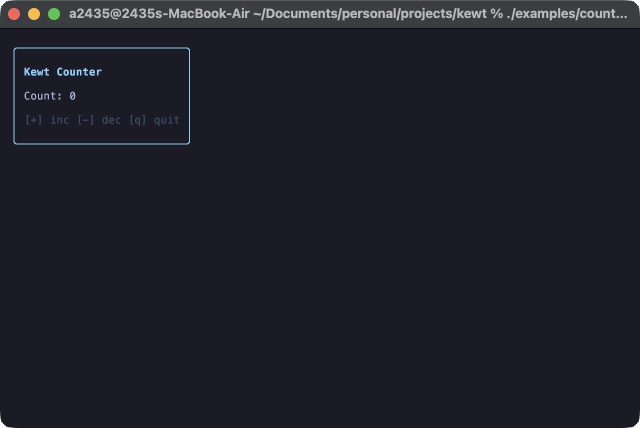

# Kewt Counter Example

A simple interactive counter application demonstrating the core reactive features of the Kewt TUI framework.



## Overview

This example showcases:
1. **Reactive State**: Using `mutableStateOf` to manage the count.
2. **Input Handling**: Mapping keys (`+`, `-`, `q`) to state changes and actions.
3. **Declarative UI**: Building a layout with `Box`, `Column`, and `Text`.
4. **Dynamic Styling**: Changing the counter color based on its value.

## How to Run

From the root of the project, run:

```bash
./gradlew :examples:counter:run
```

## Controls
- `+`: Increment the counter
- `-`: Decrement the counter
- `q`: Exit the application

## Code

```kotlin
fun main() = kewt {
    var count by mutableStateOf(0)

    onKey('+') { count++ }
    onKey('-') { count-- }
    onKey('q') { exit() }

    setContent {
        Box(modifier = Modifier.border(BorderStyle.Rounded, Color.Cyan)) {
            Column(modifier = Modifier.padding(1)) {
                Text("Kewt Counter", modifier = Modifier.foreground(Color.Cyan).bold())
                Text("")
                Text(
                    "Count: $count",
                    modifier = Modifier.foreground(
                        when {
                            count > 0 -> Color.Green
                            count < 0 -> Color.Red
                            else -> Color.White
                        },
                    ),
                )
                Text("")
                Text("[+] inc [-] dec [q] quit", modifier = Modifier.foreground(Color.BrightBlack))
            }
        }
    }
}
```
